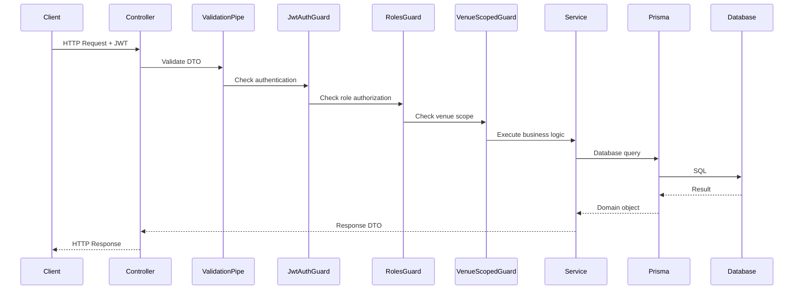

# Technical Design Document: Phase 2 Core Domain

## Overview

Phase 2 builds the core domain model for Splitcore, a Nigerian entertainment payments platform starting with digital tipping in Lagos nightlife. This phase introduces the fundamental entities and relationships that enable venue management, entertainer onboarding, QR code-based tipping links, and configurable revenue split rules.

**Scope**: Domain modeling and CRUD APIs only. Payment processing, ledger entries, payouts, and KYC verification flows are deferred to Phase 3+.

**Foundation**: Phase 1 delivered NestJS with Prisma ORM, JWT authentication, Redis/BullMQ, structured logging (Pino), global error handling, validation, rate limiting, and CI/CD. Phase 2 builds on this infrastructure.

### Key Entities

- **Venue**: Physical entertainment locations (clubs, lounges) where tipping occurs
- **Entertainer**: DJs, performers, or artists who receive tips
- **Venue-Entertainer Relationships**: Many-to-many associations allowing entertainers to work at multiple venues
- **QR Code**: Scannable codes linking to a venue and optionally an entertainer, identified by cryptographically random public tokens
- **Guest Session**: Temporary sessions created when guests scan QR codes (unauthenticated users)
- **Split Rule**: Venue-level revenue distribution configuration (entertainer/venue/platform shares in basis points)

### Key Design Principles

1. **Venue-Scoped Access Control**: Venue admins can only access resources for their assigned venue
2. **Basis Points for Monetary Values**: All percentages stored as integers (10000 = 100.00%) to avoid floating-point precision issues
3. **Soft Deletes**: Venues, entertainers, QR codes, and split rules use `isActive` flags rather than hard deletion
4. **Append-Only Split Rules**: Historical rules preserved by setting `effectiveTo` timestamp
5. **Cryptographically Random Tokens**: QR code public tokens must be unguessable and at least 16 characters
6. **Validation at API Boundary**: All DTOs use class-validator decorators for consistent validation
7. **Swagger Documentation**: All endpoints fully documented with request/response schemas

## Architecture

### Module Structure

Phase 2 introduces five new NestJS modules following the existing patterns from Phase 1:

```
src/
├── venues/
│   ├── venues.module.ts
│   ├── venues.controller.ts
│   ├── venues.service.ts
│   ├── dto/
│   │   ├── create-venue.dto.ts
│   │   ├── update-venue.dto.ts
│   │   └── venue-response.dto.ts
│   └── venues.service.spec.ts
├── entertainers/
│   ├── entertainers.module.ts
│   ├── entertainers.controller.ts
│   ├── entertainers.service.ts
│   ├── dto/
│   │   ├── create-entertainer.dto.ts
│   │   ├── update-entertainer.dto.ts
│   │   ├── link-entertainer.dto.ts
│   │   └── entertainer-response.dto.ts
│   └── entertainers.service.spec.ts
├── qr-codes/
│   ├── qr-codes.module.ts
│   ├── qr-codes.controller.ts
│   ├── qr-codes.service.ts
│   ├── dto/
│   │   ├── create-qr-code.dto.ts
│   │   └── qr-code-response.dto.ts
│   └── qr-codes.service.spec.ts
├── guest/
│   ├── guest.module.ts
│   ├── guest.controller.ts
│   ├── guest.service.ts
│   ├── dto/
│   │   └── qr-resolution-response.dto.ts
│   └── guest.service.spec.ts
├── split-rules/
│   ├── split-rules.module.ts
│   ├── split-rules.controller.ts
│   ├── split-rules.service.ts
│   ├── dto/
│   │   ├── create-split-rule.dto.ts
│   │   └── split-rule-response.dto.ts
│   └── split-rules.service.spec.ts
└── common/
    └── guards/
        └── venue-scoped.guard.ts  (new)
```

### Request Flow



### Guard Execution Order

The existing APP_GUARD configuration in `app.module.ts` runs guards in this order:

1. **JwtAuthGuard**: Verifies JWT token and populates `request.user` (skipped for `@Public()` routes)
2. **RolesGuard**: Checks if user has required role from `@Roles()` decorator
3. **VenueScopedGuard** (new): For venue-scoped resources, validates venue admin can only access their venue
4. **ThrottlerGuard**: Rate limiting (runs after auth/authz to avoid penalizing legitimate users)

### Venue-Scoped Access Control Strategy

Rather than scattering `if (user.role === 'VENUE_ADMIN' && user.venueId !== resourceVenueId)` checks throughout services, we implement a **VenueScopedGuard** that:

1. Runs after JwtAuthGuard and RolesGuard
2. Is applied via a custom `@VenueScoped()` decorator on controller methods
3. Extracts venue ID from request params (`:venueId`) or body (`venueId` field)
4. Allows Platform Admins to access any venue
5. Restricts Venue Admins to only their assigned venue (returns 403 Forbidden for mismatches)

This pattern centralizes access control logic and makes venue-scoping explicit at the route level.

## Components and Interfaces

### Data Models

#### Prisma Schema Extensions

The following schema additions extend the existing Phase 1 `User` model:

```prisma
// Add to existing User model
model User {
  id           String   @id @default(uuid())
  email        String   @unique
  passwordHash String   @map("password_hash")
  role         Role
  isActive     Boolean  @default(true) @map("is_active")
  venueId      String?  @map("venue_id")  // NEW: null for PLATFORM_ADMIN, required for VENUE_ADMIN
  createdAt    DateTime @default(now()) @map("created_at")
  updatedAt    DateTime @updatedAt @map("updated_at")

  venue        Venue?   @relation(fields: [venueId], references: [id])  // NEW

  @@map("users")
}

// NEW: KYC status enumeration (modeling only, no verification flow yet)
enum KycStatus {
  NOT_STARTED
  PENDING
  VERIFIED
  FAILED
  REVIEW
  SUSPENDED
}

// NEW: Venue model
model Venue {
  id        String   @id @default(uuid())
  name      String
  slug      String   @unique
  logoUrl   String?  @map("logo_url")
  location  String
  isActive  Boolean  @default(true) @map("is_active")
  createdAt DateTime @default(now()) @map("created_at")
  updatedAt DateTime @updatedAt @map("updated_at")

  users             User[]
  venueEntertainers VenueEntertainer[]
  qrCodes           QrCode[]
  splitRules        SplitRule[]

  @@map("venues")
}

// NEW: Entertainer model
model Entertainer {
  id            String     @id @default(uuid())
  stageName     String     @map("stage_name")
  legalName     String     @map("legal_name")
  phone         String     @unique
  bankName      String?    @map("bank_name")
  accountNumber String?    @map("account_number")
  kycStatus     KycStatus  @default(NOT_STARTED) @map("kyc_status")
  isActive      Boolean    @default(true) @map("is_active")
  createdAt     DateTime   @default(now()) @map("created_at")
  updatedAt     DateTime   @updatedAt @map("updated_at")

  venueEntertainers VenueEntertainer[]
  qrCodes           QrCode[]

  @@map("entertainers")
}

// NEW: Many-to-many join table for venue-entertainer relationships
model VenueEntertainer {
  id            String   @id @default(uuid())
  venueId       String   @map("venue_id")
  entertainerId String   @map("entertainer_id")
  createdAt     DateTime @default(now()) @map("created_at")

  venue       Venue       @relation(fields: [venueId], references: [id], onDelete: Cascade)
  entertainer Entertainer @relation(fields: [entertainerId], references: [id], onDelete: Cascade)

  @@unique([venueId, entertainerId])
  @@map("venue_entertainers")
}

// NEW: QR code model with cryptographically random public tokens
model QrCode {
  id            String    @id @default(uuid())
  publicToken   String    @unique @map("public_token")
  venueId       String    @map("venue_id")
  entertainerId String?   @map("entertainer_id")
  location      String    // e.g., "Main Stage", "VIP Lounge"
  isActive      Boolean   @default(true) @map("is_active")
  deactivatedAt DateTime? @map("deactivated_at")
  createdAt     DateTime  @default(now()) @map("created_at")
  updatedAt     DateTime  @updatedAt @map("updated_at")

  venue         Venue         @relation(fields: [venueId], references: [id])
  entertainer   Entertainer?  @relation(fields: [entertainerId], references: [id])
  guestSessions GuestSession[]

  @@map("qr_codes")
}

// NEW: Guest session model (created when unauthenticated users scan QR codes)
model GuestSession {
  id        String   @id @default(uuid())
  qrCodeId  String   @map("qr_code_id")
  createdAt DateTime @default(now()) @map("created_at")
  expiresAt DateTime @map("expires_at")

  qrCode QrCode @relation(fields: [qrCodeId], references: [id])

  @@map("guest_sessions")
}

// NEW: Split rule model (append-only history via effectiveTo timestamp)
model SplitRule {
  id             String    @id @default(uuid())
  venueId        String    @map("venue_id")
  entertainerBps Int       @map("entertainer_bps")  // basis points (10000 = 100%)
  venueBps       Int       @map("venue_bps")
  platformBps    Int       @map("platform_bps")
  effectiveFrom  DateTime  @default(now()) @map("effective_from")
  effectiveTo    DateTime? @map("effective_to")     // null = currently active
  createdAt      DateTime  @default(now()) @map("created_at")
  updatedAt      DateTime  @updatedAt @map("updated_at")

  venue Venue @relation(fields: [venueId], references: [id])

  @@index([venueId, effectiveFrom])
  @@map("split_rules")
}
```

### API Endpoints

#### Venues Module

**Base Path**: `/venues`

| Method | Endpoint | Auth | Description |
|--------|----------|------|-------------|
| POST | `/venues` | PLATFORM_ADMIN | Create a new venue |
| GET | `/venues` | PLATFORM_ADMIN, VENUE_ADMIN | List all venues (venue admins see only their venue) |
| GET | `/venues/:venueId` | PLATFORM_ADMIN, VENUE_ADMIN | Get venue details |
| PATCH | `/venues/:venueId` | PLATFORM_ADMIN, @VenueScoped | Update venue |
| DELETE | `/venues/:venueId` | PLATFORM_ADMIN, @VenueScoped | Deactivate venue (soft delete) |

**DTOs**:

```typescript
// create-venue.dto.ts
export class CreateVenueDto {
  @ApiProperty({ description: 'Venue name', example: 'Quilox Nightclub' })
  @IsString()
  @MinLength(1)
  @MaxLength(100)
  name!: string;

  @ApiProperty({ 
    description: 'URL-friendly slug (lowercase letters, numbers, hyphens only)', 
    example: 'quilox-nightclub' 
  })
  @IsString()
  @Matches(/^[a-z0-9-]+$/, { message: 'Slug must contain only lowercase letters, numbers, and hyphens' })
  @MinLength(1)
  @MaxLength(50)
  slug!: string;

  @ApiProperty({ 
    description: 'URL to venue logo image', 
    example: 'https://example.com/logo.png',
    required: false 
  })
  @IsOptional()
  @IsUrl()
  logoUrl?: string;

  @ApiProperty({ description: 'Venue location/address', example: 'Victoria Island, Lagos' })
  @IsString()
  @MinLength(1)
  @MaxLength(200)
  location!: string;
}

// update-venue.dto.ts
export class UpdateVenueDto {
  @ApiProperty({ description: 'Venue name', required: false })
  @IsOptional()
  @IsString()
  @MinLength(1)
  @MaxLength(100)
  name?: string;

  @ApiProperty({ description: 'URL to venue logo image', required: false })
  @IsOptional()
  @IsUrl()
  logoUrl?: string;

  @ApiProperty({ description: 'Venue location/address', required: false })
  @IsOptional()
  @IsString()
  @MinLength(1)
  @MaxLength(200)
  location?: string;

  @ApiProperty({ description: 'Active status', required: false })
  @IsOptional()
  @IsBoolean()
  isActive?: boolean;
}

// venue-response.dto.ts
export class VenueResponseDto {
  @ApiProperty({ example: 'uuid-string' })
  id!: string;

  @ApiProperty({ example: 'Quilox Nightclub' })
  name!: string;

  @ApiProperty({ example: 'quilox-nightclub' })
  slug!: string;

  @ApiProperty({ example: 'https://example.com/logo.png', nullable: true })
  logoUrl!: string | null;

  @ApiProperty({ example: 'Victoria Island, Lagos' })
  location!: string;

  @ApiProperty({ example: true })
  isActive!: boolean;

  @ApiProperty({ example: '2024-01-15T10:30:00Z' })
  createdAt!: Date;

  @ApiProperty({ example: '2024-01-15T10:30:00Z' })
  updatedAt!: Date;
}
```

#### Entertainers Module

**Base Path**: `/entertainers`

| Method | Endpoint | Auth | Description |
|--------|----------|------|-------------|
| POST | `/entertainers` | PLATFORM_ADMIN, VENUE_ADMIN | Create a new entertainer |
| GET | `/entertainers` | PLATFORM_ADMIN, VENUE_ADMIN | List entertainers (filtered by venue access) |
| GET | `/entertainers/:entertainerId` | PLATFORM_ADMIN, VENUE_ADMIN | Get entertainer details |
| PATCH | `/entertainers/:entertainerId` | PLATFORM_ADMIN, VENUE_ADMIN | Update entertainer |
| DELETE | `/entertainers/:entertainerId` | PLATFORM_ADMIN, VENUE_ADMIN | Deactivate entertainer and associated QR codes |
| POST | `/entertainers/:entertainerId/venues/:venueId` | PLATFORM_ADMIN, @VenueScoped | Link entertainer to venue |
| DELETE | `/entertainers/:entertainerId/venues/:venueId` | PLATFORM_ADMIN, @VenueScoped | Unlink entertainer from venue |

**DTOs**:

```typescript
// create-entertainer.dto.ts
export class CreateEntertainerDto {
  @ApiProperty({ description: 'Stage name', example: 'DJ Neptune' })
  @IsString()
  @MinLength(1)
  @MaxLength(100)
  stageName!: string;

  @ApiProperty({ description: 'Legal name (for KYC)', example: 'Patrick Imohiosen' })
  @IsString()
  @MinLength(1)
  @MaxLength(100)
  legalName!: string;

  @ApiProperty({ description: 'Phone number (unique)', example: '+2348012345678' })
  @IsString()
  @Matches(/^\+?[1-9]\d{1,14}$/, { message: 'Phone must be a valid E.164 format' })
  phone!: string;

  @ApiProperty({ description: 'Bank name', required: false, example: 'GTBank' })
  @IsOptional()
  @IsString()
  @MaxLength(100)
  bankName?: string;

  @ApiProperty({ 
    description: 'Bank account number (digits only)', 
    required: false, 
    example: '0123456789' 
  })
  @IsOptional()
  @IsString()
  @Matches(/^\d+$/, { message: 'Account number must contain only digits' })
  @MinLength(10)
  @MaxLength(10)
  accountNumber?: string;
}

// update-entertainer.dto.ts
export class UpdateEntertainerDto {
  @ApiProperty({ description: 'Stage name', required: false })
  @IsOptional()
  @IsString()
  @MinLength(1)
  @MaxLength(100)
  stageName?: string;

  @ApiProperty({ description: 'Legal name', required: false })
  @IsOptional()
  @IsString()
  @MinLength(1)
  @MaxLength(100)
  legalName?: string;

  @ApiProperty({ description: 'Phone number', required: false })
  @IsOptional()
  @IsString()
  @Matches(/^\+?[1-9]\d{1,14}$/, { message: 'Phone must be a valid E.164 format' })
  phone?: string;

  @ApiProperty({ description: 'Bank name', required: false })
  @IsOptional()
  @IsString()
  @MaxLength(100)
  bankName?: string;

  @ApiProperty({ description: 'Bank account number', required: false })
  @IsOptional()
  @IsString()
  @Matches(/^\d+$/, { message: 'Account number must contain only digits' })
  @MinLength(10)
  @MaxLength(10)
  accountNumber?: string;

  @ApiProperty({ description: 'Active status', required: false })
  @IsOptional()
  @IsBoolean()
  isActive?: boolean;
}

// link-entertainer.dto.ts
// No body needed for link/unlink operations; venueId and entertainerId come from URL params

// entertainer-response.dto.ts
export class EntertainerResponseDto {
  @ApiProperty({ example: 'uuid-string' })
  id!: string;

  @ApiProperty({ example: 'DJ Neptune' })
  stageName!: string;

  @ApiProperty({ example: 'Patrick Imohiosen' })
  legalName!: string;

  @ApiProperty({ example: '+2348012345678' })
  phone!: string;

  @ApiProperty({ example: 'GTBank', nullable: true })
  bankName!: string | null;

  @ApiProperty({ example: '0123456789', nullable: true })
  accountNumber!: string | null;

  @ApiProperty({ enum: ['NOT_STARTED', 'PENDING', 'VERIFIED', 'FAILED', 'REVIEW', 'SUSPENDED'] })
  kycStatus!: string;

  @ApiProperty({ example: true })
  isActive!: boolean;

  @ApiProperty({ example: '2024-01-15T10:30:00Z' })
  createdAt!: Date;

  @ApiProperty({ example: '2024-01-15T10:30:00Z' })
  updatedAt!: Date;

  @ApiProperty({ description: 'List of venue IDs this entertainer is linked to', type: [String] })
  venueIds!: string[];
}
```

#### QR Codes Module

**Base Path**: `/qr-codes`

| Method | Endpoint | Auth | Description |
|--------|----------|------|-------------|
| POST | `/qr-codes` | PLATFORM_ADMIN, @VenueScoped | Generate a new QR code |
| GET | `/qr-codes` | PLATFORM_ADMIN, VENUE_ADMIN | List QR codes (filtered by venue access) |
| GET | `/qr-codes/:qrCodeId` | PLATFORM_ADMIN, VENUE_ADMIN | Get QR code details |
| DELETE | `/qr-codes/:qrCodeId` | PLATFORM_ADMIN, VENUE_ADMIN | Deactivate QR code |
| POST | `/qr-codes/:qrCodeId/regenerate` | PLATFORM_ADMIN, VENUE_ADMIN | Regenerate QR code (new token) |

**DTOs**:

```typescript
// create-qr-code.dto.ts
export class CreateQrCodeDto {
  @ApiProperty({ description: 'Venue ID', example: 'uuid-string' })
  @IsUUID()
  venueId!: string;

  @ApiProperty({ 
    description: 'Entertainer ID (optional - null for venue-only QR codes)', 
    required: false,
    nullable: true,
    example: 'uuid-string' 
  })
  @IsOptional()
  @IsUUID()
  entertainerId?: string | null;

  @ApiProperty({ description: 'Location label within venue', example: 'Main Stage' })
  @IsString()
  @MinLength(1)
  @MaxLength(100)
  location!: string;
}

// qr-code-response.dto.ts
export class QrCodeResponseDto {
  @ApiProperty({ example: 'uuid-string' })
  id!: string;

  @ApiProperty({ example: 'a1b2c3d4e5f6g7h8' })
  publicToken!: string;

  @ApiProperty({ example: 'uuid-string' })
  venueId!: string;

  @ApiProperty({ example: 'uuid-string', nullable: true })
  entertainerId!: string | null;

  @ApiProperty({ example: 'Main Stage' })
  location!: string;

  @ApiProperty({ example: true })
  isActive!: boolean;

  @ApiProperty({ example: '2024-01-15T10:30:00Z', nullable: true })
  deactivatedAt!: Date | null;

  @ApiProperty({ example: '2024-01-15T10:30:00Z' })
  createdAt!: Date;

  @ApiProperty({ example: '2024-01-15T10:30:00Z' })
  updatedAt!: Date;

  @ApiProperty({ description: 'Venue details', type: VenueResponseDto })
  venue?: VenueResponseDto;

  @ApiProperty({ description: 'Entertainer details', type: EntertainerResponseDto, nullable: true })
  entertainer?: EntertainerResponseDto | null;
}
```

#### Guest Module

**Base Path**: `/t` (short for "tip")

| Method | Endpoint | Auth | Description |
|--------|----------|------|-------------|
| GET | `/t/:publicToken` | @Public() | Resolve QR code and create guest session |

**DTOs**:

```typescript
// qr-resolution-response.dto.ts
export class QrResolutionResponseDto {
  @ApiProperty({ example: 'uuid-string' })
  sessionId!: string;

  @ApiProperty({ description: 'Venue details' })
  venue!: {
    id: string;
    name: string;
    logoUrl: string | null;
    location: string;
  };

  @ApiProperty({ description: 'Entertainer details (null for venue-only QR codes)', nullable: true })
  entertainer!: {
    id: string;
    stageName: string;
  } | null;

  @ApiProperty({ example: 'Main Stage' })
  location!: string;

  @ApiProperty({ example: '2024-01-16T10:30:00Z' })
  expiresAt!: Date;
}
```

#### Split Rules Module

**Base Path**: `/split-rules`

| Method | Endpoint | Auth | Description |
|--------|----------|------|-------------|
| POST | `/split-rules` | PLATFORM_ADMIN, @VenueScoped | Create a new split rule |
| GET | `/split-rules/venue/:venueId` | PLATFORM_ADMIN, @VenueScoped | Get all split rules for a venue |
| GET | `/split-rules/venue/:venueId/active` | PLATFORM_ADMIN, @VenueScoped | Get active split rule for a venue |

**DTOs**:

```typescript
// create-split-rule.dto.ts
export class CreateSplitRuleDto {
  @ApiProperty({ description: 'Venue ID', example: 'uuid-string' })
  @IsUUID()
  venueId!: string;

  @ApiProperty({ 
    description: 'Entertainer share in basis points (10000 = 100%)', 
    example: 6500  // 65.00%
  })
  @IsInt()
  @Min(0)
  @Max(10000)
  entertainerBps!: number;

  @ApiProperty({ 
    description: 'Venue share in basis points', 
    example: 2500  // 25.00%
  })
  @IsInt()
  @Min(0)
  @Max(10000)
  venueBps!: number;

  @ApiProperty({ 
    description: 'Platform share in basis points', 
    example: 1000  // 10.00%
  })
  @IsInt()
  @Min(0)
  @Max(10000)
  platformBps!: number;

  @Validate(SplitRuleSumValidator)  // Custom validator ensuring sum === 10000
  _splitSum?: void;  // Phantom property for cross-field validation
}

// split-rule-response.dto.ts
export class SplitRuleResponseDto {
  @ApiProperty({ example: 'uuid-string' })
  id!: string;

  @ApiProperty({ example: 'uuid-string' })
  venueId!: string;

  @ApiProperty({ example: 6500 })
  entertainerBps!: number;

  @ApiProperty({ example: 2500 })
  venueBps!: number;

  @ApiProperty({ example: 1000 })
  platformBps!: number;

  @ApiProperty({ example: '2024-01-15T10:30:00Z' })
  effectiveFrom!: Date;

  @ApiProperty({ example: '2024-01-20T10:30:00Z', nullable: true })
  effectiveTo!: Date | null;

  @ApiProperty({ example: '2024-01-15T10:30:00Z' })
  createdAt!: Date;

  @ApiProperty({ example: '2024-01-15T10:30:00Z' })
  updatedAt!: Date;
}
```

### Service Layer Contracts

#### VenuesService

```typescript
export class VenuesService {
  create(dto: CreateVenueDto): Promise<Venue>;
  findAll(userId: string, userRole: Role): Promise<Venue[]>;
  findOne(id: string): Promise<Venue>;
  update(id: string, dto: UpdateVenueDto): Promise<Venue>;
  deactivate(id: string): Promise<Venue>;
}
```

#### EntertainersService

```typescript
export class EntertainersService {
  create(dto: CreateEntertainerDto): Promise<Entertainer>;
  findAll(userId: string, userRole: Role, venueId?: string): Promise<Entertainer[]>;
  findOne(id: string): Promise<Entertainer>;
  update(id: string, dto: UpdateEntertainerDto): Promise<Entertainer>;
  deactivate(id: string): Promise<Entertainer>;
  linkToVenue(entertainerId: string, venueId: string): Promise<VenueEntertainer>;
  unlinkFromVenue(entertainerId: string, venueId: string): Promise<void>;
}
```

#### QrCodesService

```typescript
export class QrCodesService {
  create(dto: CreateQrCodeDto): Promise<QrCode>;
  findAll(userId: string, userRole: Role, venueId?: string): Promise<QrCode[]>;
  findOne(id: string): Promise<QrCode>;
  deactivate(id: string): Promise<QrCode>;
  regenerate(id: string): Promise<QrCode>;
  generatePublicToken(): string;  // Cryptographically random, ≥16 chars
}
```

#### GuestService

```typescript
export class GuestService {
  resolveQrCode(publicToken: string): Promise<QrResolutionResponseDto>;
}
```

#### SplitRulesService

```typescript
export class SplitRulesService {
  create(dto: CreateSplitRuleDto): Promise<SplitRule>;
  findAllForVenue(venueId: string): Promise<SplitRule[]>;
  findActiveForVenue(venueId: string): Promise<SplitRule | null>;
}
```

### Custom Guard: VenueScopedGuard

```typescript
import { CanActivate, ExecutionContext, Injectable, ForbiddenException } from '@nestjs/common';
import { Reflector } from '@nestjs/core';
import { Role } from '@prisma/client';

export const VENUE_SCOPED_KEY = 'venueScoped';
export const VenueScoped = () => SetMetadata(VENUE_SCOPED_KEY, true);

@Injectable()
export class VenueScopedGuard implements CanActivate {
  constructor(private readonly reflector: Reflector) {}

  canActivate(context: ExecutionContext): boolean {
    const isVenueScoped = this.reflector.getAllAndOverride<boolean>(VENUE_SCOPED_KEY, [
      context.getHandler(),
      context.getClass(),
    ]);

    if (!isVenueScoped) {
      return true;  // Not a venue-scoped route
    }

    const request = context.switchToHttp().getRequest();
    const user = request.user;

    // Platform admins bypass venue scoping
    if (user.role === Role.PLATFORM_ADMIN) {
      return true;
    }

    // Venue admins must access only their assigned venue
    if (user.role === Role.VENUE_ADMIN) {
      const resourceVenueId = request.params.venueId || request.body?.venueId;
      
      if (!resourceVenueId) {
        throw new ForbiddenException('Venue ID required for venue-scoped operation');
      }

      if (user.venueId !== resourceVenueId) {
        throw new ForbiddenException('Access denied to this venue');
      }

      return true;
    }

    throw new ForbiddenException('Insufficient permissions');
  }
}
```

### Custom Validator: SplitRuleSumValidator

```typescript
import { ValidatorConstraint, ValidatorConstraintInterface, ValidationArguments } from 'class-validator';

@ValidatorConstraint({ name: 'splitRuleSum', async: false })
export class SplitRuleSumValidator implements ValidatorConstraintInterface {
  validate(value: any, args: ValidationArguments): boolean {
    const obj = args.object as CreateSplitRuleDto;
    const sum = obj.entertainerBps + obj.venueBps + obj.platformBps;
    return sum === 10000;
  }

  defaultMessage(args: ValidationArguments): string {
    const obj = args.object as CreateSplitRuleDto;
    const sum = obj.entertainerBps + obj.venueBps + obj.platformBps;
    return `Split rule basis points must sum to exactly 10000 (received ${sum})`;
  }
}
```

## Data Models

See **Components and Interfaces > Data Models > Prisma Schema Extensions** above for the complete schema.

### Key Constraints

1. **Unique Constraints**:
   - `Venue.slug` - Ensures URL-friendly venue identifiers are unique
   - `Entertainer.phone` - One phone number per entertainer
   - `VenueEntertainer.[venueId, entertainerId]` - Prevents duplicate venue-entertainer links
   - `QrCode.publicToken` - Ensures each QR code has a unique identifier

2. **Foreign Key Relationships**:
   - `User.venueId` → `Venue.id` (nullable for platform admins)
   - `VenueEntertainer.venueId` → `Venue.id` (cascade delete)
   - `VenueEntertainer.entertainerId` → `Entertainer.id` (cascade delete)
   - `QrCode.venueId` → `Venue.id`
   - `QrCode.entertainerId` → `Entertainer.id` (nullable for venue-only codes)
   - `GuestSession.qrCodeId` → `QrCode.id`
   - `SplitRule.venueId` → `Venue.id`

3. **Indexes**:
   - `SplitRule.[venueId, effectiveFrom]` - Optimizes historical split rule queries

4. **Validation Rules**:
   - `Venue.slug` - Lowercase letters, numbers, hyphens only
   - `Entertainer.phone` - E.164 format
   - `Entertainer.accountNumber` - Digits only, 10 characters
   - `SplitRule.{entertainerBps + venueBps + platformBps}` - Must equal exactly 10000
   - `QrCode.publicToken` - Cryptographically random, minimum 16 characters

## Error Handling

### HTTP Status Codes

All endpoints follow consistent status code conventions:

| Status | Usage |
|--------|-------|
| 200 OK | Successful GET, PATCH |
| 201 Created | Successful POST |
| 400 Bad Request | Validation failure, business rule violation |
| 401 Unauthorized | Missing or invalid JWT token |
| 403 Forbidden | Insufficient permissions (role or venue-scoping) |
| 404 Not Found | Resource not found by ID |
| 409 Conflict | Duplicate constraint violation (slug, phone, etc.) |
| 410 Gone | Deactivated resource accessed (QR codes, venues) |
| 500 Internal Server Error | Unhandled exceptions |

### Error Response Format

All errors use the consistent format from `AllExceptionsFilter`:

```json
{
  "statusCode": 400,
  "error": "BadRequestException",
  "message": "Validation failed: slug must contain only lowercase letters, numbers, and hyphens",
  "path": "/venues",
  "timestamp": "2024-01-15T10:30:00.000Z"
}
```

### Domain-Specific Error Scenarios

#### Venue Errors

- **Duplicate slug**: 409 Conflict
- **Invalid slug format**: 400 Bad Request
- **Venue not found**: 404 Not Found
- **Deactivated venue accessed**: 410 Gone (for guest QR resolution)

#### Entertainer Errors

- **Duplicate phone**: 409 Conflict
- **Invalid phone format**: 400 Bad Request
- **Entertainer not found**: 404 Not Found
- **Already linked to venue**: 409 Conflict
- **Not linked to venue**: 404 Not Found (on unlink)
- **Deactivated entertainer accessed**: 410 Gone (for guest QR resolution)

#### QR Code Errors

- **Venue not found**: 400 Bad Request (from DTO validation)
- **Entertainer not found**: 400 Bad Request (from DTO validation)
- **Entertainer not linked to venue**: 400 Bad Request
- **QR code not found**: 404 Not Found
- **Deactivated QR code scanned**: 410 Gone

#### Split Rule Errors

- **Basis points sum ≠ 10000**: 400 Bad Request
- **Negative basis points**: 400 Bad Request
- **Venue not found**: 400 Bad Request (from DTO validation)
- **No active split rule for venue**: 404 Not Found

#### Access Control Errors

- **Venue admin accessing another venue**: 403 Forbidden
- **Non-admin attempting admin operation**: 403 Forbidden

## Testing Strategy

### Unit Testing

**Target**: Individual service methods with mocked dependencies

**Tools**: Jest, Prisma mock utilities

**Coverage Goals**:
- All service methods: 100%
- Business logic branches: 100%
- Error handling paths: 100%

**Key Test Scenarios**:

1. **VenuesService**:
   - Create venue with valid data
   - Create venue with duplicate slug (expect 409)
   - Update venue fields
   - Deactivate venue (isActive set to false)
   - findAll filters by venueId for VENUE_ADMIN role

2. **EntertainersService**:
   - Create entertainer with valid data
   - Create entertainer with duplicate phone (expect 409)
   - Link entertainer to venue
   - Link already-linked entertainer (expect 409)
   - Unlink entertainer from venue
   - Deactivate entertainer (isActive + cascade QR code deactivation)

3. **QrCodesService**:
   - Generate QR code with entertainer
   - Generate venue-only QR code (null entertainerId)
   - Generate unique public tokens (test randomness, length ≥16)
   - Deactivate QR code (isActive + deactivatedAt timestamp)
   - Regenerate QR code (old deactivated, new created)

4. **GuestService**:
   - Resolve valid active QR code (creates guest session)
   - Resolve deactivated QR code (expect 410)
   - Resolve unknown token (expect 404)
   - Resolve QR code with deactivated venue (expect 410)
   - Resolve QR code with deactivated entertainer (expect 410)
   - Guest session expiration set to 24 hours

5. **SplitRulesService**:
   - Create split rule with valid basis points (sum = 10000)
   - Create split rule with invalid sum (expect 400)
   - Create new rule supersedes previous (effectiveTo set)
   - Find active rule (effectiveTo IS NULL)
   - Find all rules ordered by effectiveFrom DESC

### Integration Testing (E2E)

**Target**: Full request/response cycle against real database instances

**Tools**: Jest, Supertest, Docker Compose (Postgres + Redis)

**Coverage Goals**:
- All endpoints: 100%
- All authentication scenarios: 100%
- All authorization scenarios: 100%

**Key Test Scenarios**:

1. **Authentication & Authorization**:
   - Unauthenticated request to protected endpoint (expect 401)
   - VENUE_ADMIN accessing another venue's resources (expect 403)
   - PLATFORM_ADMIN accessing any venue's resources (expect 200)
   - @Public() endpoint accessible without JWT (guest QR resolution)

2. **Validation**:
   - Invalid DTO fields (expect 400 with field-level errors)
   - Missing required fields (expect 400)
   - Invalid UUID formats (expect 400)

3. **Business Rules**:
   - Duplicate venue slug (expect 409)
   - Duplicate entertainer phone (expect 409)
   - Split rule sum ≠ 10000 (expect 400)
   - Link entertainer not associated with venue to QR code (expect 400)

4. **Data Integrity**:
   - Deactivate venue does not cascade to users
   - Deactivate entertainer cascades to QR codes
   - Delete venue-entertainer link preserves both entities
   - Split rule history preserved when new rule created

5. **Guest QR Resolution**:
   - Scan valid QR code creates guest session
   - Scan deactivated QR code returns 410
   - Scan QR code with deactivated venue returns 410
   - Scan QR code with deactivated entertainer returns 410
   - Guest session expires in 24 hours

### Property-Based Testing

Property-based testing is **NOT applicable** to Phase 2 for the following reasons:

1. **CRUD Operations**: Endpoints are simple create/read/update/delete operations with no complex transformation logic
2. **Database Constraints**: Validation is primarily handled by Prisma schema constraints and class-validator decorators
3. **External Dependencies**: All logic depends on database state, not pure functions
4. **Integration Testing Sufficiency**: Example-based e2e tests with concrete scenarios provide sufficient coverage

**Testing Strategy**: Use example-based unit tests for service logic and e2e tests for API endpoints.

### Test Infrastructure

**Setup**:
```typescript
// test/setup-e2e.ts
beforeAll(async () => {
  // Start Docker Compose services (Postgres, Redis)
  // Run Prisma migrations
  // Seed test data (platform admin user, sample venue)
});

afterEach(async () => {
  // Clean up test data (except seed data)
});

afterAll(async () => {
  // Stop Docker Compose services
});
```

**Test Factories** (in `test/utils/test-factories.ts`):
- `createTestVenue(overrides?: Partial<CreateVenueDto>)`
- `createTestEntertainer(overrides?: Partial<CreateEntertainerDto>)`
- `createTestQrCode(venueId: string, entertainerId?: string)`
- `createTestSplitRule(venueId: string, overrides?: Partial<CreateSplitRuleDto>)`
- `createTestUser(role: Role, venueId?: string)`

### CI/CD Integration

All tests run in GitHub Actions CI pipeline:

```yaml
# .github/workflows/ci.yml
jobs:
  test:
    services:
      postgres:
        image: postgres:16
        env:
          POSTGRES_PASSWORD: test
      redis:
        image: redis:7
    steps:
      - run: npm run test        # Unit tests
      - run: npm run test:e2e    # E2E tests with service containers
      - run: npm run test:cov    # Coverage report (threshold: 80%)
```

## Implementation Notes

### Token Generation

Use Node.js `crypto` module for cryptographically random QR code tokens:

```typescript
import { randomBytes } from 'crypto';

generatePublicToken(): string {
  // 16 bytes = 32 hex characters
  return randomBytes(16).toString('hex');
}
```

### Split Rule Supersession

When creating a new split rule for a venue with an existing active rule:

```typescript
async create(dto: CreateSplitRuleDto): Promise<SplitRule> {
  // Find current active rule (effectiveTo IS NULL)
  const currentRule = await this.prisma.splitRule.findFirst({
    where: { venueId: dto.venueId, effectiveTo: null },
  });

  // Create new rule and update old rule in a transaction
  return this.prisma.$transaction(async (tx) => {
    if (currentRule) {
      await tx.splitRule.update({
        where: { id: currentRule.id },
        data: { effectiveTo: new Date() },
      });
    }

    return tx.splitRule.create({
      data: {
        venueId: dto.venueId,
        entertainerBps: dto.entertainerBps,
        venueBps: dto.venueBps,
        platformBps: dto.platformBps,
        effectiveFrom: new Date(),
        effectiveTo: null,
      },
    });
  });
}
```

### Guest Session Expiration

Set expiration to 24 hours from creation:

```typescript
async resolveQrCode(publicToken: string): Promise<QrResolutionResponseDto> {
  // ... QR code resolution logic ...

  const expiresAt = new Date();
  expiresAt.setHours(expiresAt.getHours() + 24);

  const session = await this.prisma.guestSession.create({
    data: {
      qrCodeId: qrCode.id,
      expiresAt,
    },
  });

  // ... return response ...
}
```

### Venue-Scoped Filtering

When listing resources for VENUE_ADMIN users, filter by their assigned venue:

```typescript
async findAll(userId: string, userRole: Role): Promise<Venue[]> {
  if (userRole === Role.PLATFORM_ADMIN) {
    return this.prisma.venue.findMany();
  }

  // VENUE_ADMIN: only return their assigned venue
  const user = await this.prisma.user.findUnique({ where: { id: userId } });
  if (!user || !user.venueId) {
    return [];
  }

  const venue = await this.prisma.venue.findUnique({ where: { id: user.venueId } });
  return venue ? [venue] : [];
}
```

### Cascade Deactivation

When deactivating an entertainer, deactivate all associated QR codes:

```typescript
async deactivate(id: string): Promise<Entertainer> {
  return this.prisma.$transaction(async (tx) => {
    // Deactivate all QR codes for this entertainer
    await tx.qrCode.updateMany({
      where: { entertainerId: id },
      data: { isActive: false, deactivatedAt: new Date() },
    });

    // Deactivate the entertainer
    return tx.entertainer.update({
      where: { id },
      data: { isActive: false },
    });
  });
}
```

## Migration Path

### Database Migrations

1. Generate Prisma migration for new schema:
```bash
npm run prisma:migrate:dev -- --name phase-2-core-domain
```

2. Seed script updates:
   - Add sample venues
   - Add sample entertainers
   - Create venue-entertainer links
   - Generate sample QR codes
   - Create default split rules

### Module Registration

Update `app.module.ts`:

```typescript
import { VenuesModule } from './venues/venues.module';
import { EntertainersModule } from './entertainers/entertainers.module';
import { QrCodesModule } from './qr-codes/qr-codes.module';
import { GuestModule } from './guest/guest.module';
import { SplitRulesModule } from './split-rules/split-rules.module';
import { VenueScopedGuard } from './common/guards/venue-scoped.guard';

@Module({
  imports: [
    // ... existing imports ...
    VenuesModule,
    EntertainersModule,
    QrCodesModule,
    GuestModule,
    SplitRulesModule,
  ],
  providers: [
    // ... existing providers ...
    { provide: APP_GUARD, useClass: VenueScopedGuard },  // Add after RolesGuard
  ],
})
export class AppModule {}
```

### Swagger Configuration

Swagger is already configured in `main.ts`. New modules will automatically appear in the Swagger UI when decorated with `@ApiTags()`.

## Design Decisions

### Decision 1: Venue-Level Split Rules Only

**Choice**: Split rules are scoped to the venue level, applying uniformly to all entertainers at that venue.

**Rationale**:
- Simpler schema (no nullable `entertainerId` on `SplitRule`)
- Clearer business logic (one active rule per venue)
- Easier to understand for venue admins
- Sufficient for Phase 2 requirements

**Future Extension**: If per-entertainer splits are needed later, add nullable `entertainerId` to `SplitRule` and update lookup logic to check entertainer-specific rules first, then fall back to venue-level defaults.

### Decision 2: Soft Deletes for Domain Entities

**Choice**: Use `isActive` flag for venues, entertainers, QR codes. Use `effectiveTo` timestamp for split rules.

**Rationale**:
- Preserves audit trail for financial reconciliation
- Allows reactivation if needed
- Historical split rules required for retroactive payment calculations
- Hard deletes reserved for join tables only (VenueEntertainer)

**Tradeoff**: Queries must always filter by `isActive: true` or `effectiveTo: null`. Consider adding Prisma middleware to inject these filters globally.

### Decision 3: Cryptographically Random QR Tokens

**Choice**: Use `crypto.randomBytes(16).toString('hex')` for QR code public tokens (32 hex characters).

**Rationale**:
- Prevents token guessing attacks (important for preventing unauthorized tipping)
- 16 bytes = 128 bits of entropy (sufficient for collision resistance)
- Hex encoding keeps tokens URL-safe and human-readable

**Alternative Considered**: UUIDs would work but provide less entropy (122 bits) and are longer.

### Decision 4: Basis Points for Split Percentages

**Choice**: Store splits as integers in basis points (10000 = 100.00%).

**Rationale**:
- Avoids floating-point precision errors in financial calculations
- Industry standard for percentage representation
- Enforces validation: sum must equal exactly 10000

**Tradeoff**: Requires conversion when displaying to users (divide by 100 for percentage display).

### Decision 5: VenueScopedGuard Decorator

**Choice**: Explicit `@VenueScoped()` decorator on controller methods that require venue-scoped access control.

**Rationale**:
- Makes venue-scoping visible at the route level (self-documenting code)
- Centralizes access control logic (avoids scattered if-checks in services)
- Easy to test (guard unit tests separate from service unit tests)
- Runs after JwtAuthGuard and RolesGuard (user already authenticated/authorized)

**Alternative Considered**: Interceptor pattern would work but guards are more idiomatic for authorization logic in NestJS.

### Decision 6: Guest Session Expiration

**Choice**: Guest sessions expire 24 hours after creation.

**Rationale**:
- Balances security (sessions don't live forever) with UX (guest doesn't have to re-scan immediately)
- Aligns with typical "add to cart" session lifetimes in e-commerce
- Simple to implement (no background cleanup job needed for Phase 2)

**Future Extension**: Add a background job to purge expired sessions (Phase 3+).

---

**Document Version**: 1.0  
**Last Updated**: January 2025  
**Status**: Ready for Review
