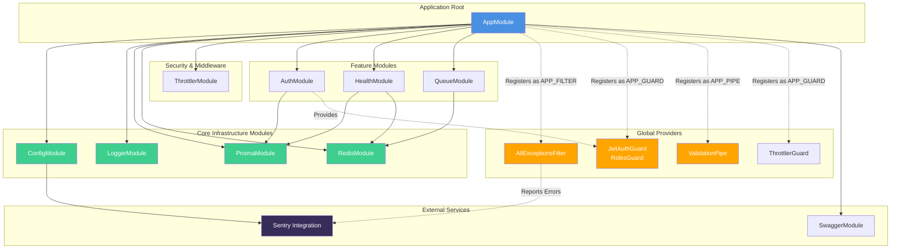

# Module Architecture

This document describes the module structure of the Splitcore backend system, including module dependencies, responsibilities, and shared infrastructure components.

## Overview

The Splitcore backend is built on a modular architecture using NestJS. The system is organized into three layers:

1. **Core Modules**: Foundation modules providing essential infrastructure (configuration, logging, database, caching)
2. **Feature Modules**: Business domain modules (authentication, health monitoring, queue processing)
3. **Infrastructure Providers**: Cross-cutting concerns applied globally (guards, filters, pipes, throttling)

## Module Dependency Diagram



## Module Responsibilities

### Core Modules

#### AppModule

**File**: `src/app.module.ts`

**Purpose**: Root module that orchestrates the entire application by importing all feature modules and registering global providers.

**Responsibilities**:
- Imports and configures all core and feature modules
- Registers global guards (JWT authentication, roles, rate limiting)
- Registers global exception filter for consistent error handling
- Registers global validation pipe for automatic DTO validation
- Configures guard execution order: authentication → authorization → rate limiting

**Key Configuration**:
```typescript
providers: [
  { provide: APP_GUARD, useClass: JwtAuthGuard },      // 1st: Authentication
  { provide: APP_GUARD, useClass: RolesGuard },        // 2nd: Authorization
  { provide: APP_GUARD, useClass: ThrottlerGuard },    // 3rd: Rate limiting
  { provide: APP_FILTER, useClass: AllExceptionsFilter }, // Error handling
  { provide: APP_PIPE, useClass: ValidationPipe },     // Request validation
]
```

#### ConfigModule

**File**: `src/config/configuration.ts`, `src/config/validation.schema.ts`

**Purpose**: Centralized environment variable management with validation.

**Responsibilities**:
- Loads environment variables from `.env` files
- Validates required variables at startup using Joi schemas
- Provides type-safe configuration access throughout the application
- Supports environment-specific configurations (development, test, production)
- Fails fast with descriptive errors for missing or invalid configuration

**Configuration Structure**:
```typescript
interface AppConfig {
  nodeEnv: string;
  port: number;
  database: { url: string };
  redis: { host: string; port: number; password?: string };
  auth: { jwtSecret: string; jwtExpiresIn: string };
  sentry: { dsn?: string; tracesSampleRate: number };
  logLevel: string;
}
```

**Scope**: Global (isGlobal: true)

#### LoggerModule

**File**: `src/common/logger/logger.module.ts`

**Purpose**: Structured JSON logging using Pino for production observability.

**Responsibilities**:
- Provides structured logging with request context (request ID, method, path, status)
- Automatically redacts sensitive data (passwords, tokens, PII)
- Generates unique request IDs for distributed tracing
- Environment-aware output (pretty-printed locally, JSON in production)
- Log level management based on response status codes

**Sensitive Data Redaction**:
- Authorization headers
- Cookie headers
- password, passwordHash, token fields
- PII fields (bvn, nin)

**Scope**: Imported and exported globally via AppModule

#### PrismaModule

**File**: `src/prisma/prisma.module.ts`, `src/prisma/prisma.service.ts`

**Purpose**: PostgreSQL database access layer using Prisma ORM.

**Responsibilities**:
- Manages database connection lifecycle (connect on init, disconnect on destroy)
- Provides connection pooling for production environments
- Implements health check ping for monitoring
- Logs slow queries (>1000ms) in production
- Handles graceful shutdown

**Connection Pool Configuration** (Production):
```typescript
{
  connection_limit: 10,      // Maximum connections
  pool_timeout: 20,          // Connection timeout (seconds)
  connect_timeout: 20,       // Initial connection timeout (seconds)
}
```

**Decorator**: @Global() - Available to all modules without explicit import

#### RedisModule

**File**: `src/redis/redis.module.ts`, `src/redis/redis.service.ts`

**Purpose**: Redis client for caching, rate limiting, and general key-value operations.

**Responsibilities**:
- Provides shared Redis connection separate from BullMQ queues
- Implements connection retry logic with exponential backoff
- Logs connection events (connect, error, close)
- Supports graceful shutdown with connection cleanup
- Provides readiness checks for health monitoring

**Retry Configuration**:
- Connection timeout: 10 seconds
- Reconnection interval: 5 seconds
- Maximum attempts: 12 (60 seconds total)
- Exit with error code after max attempts exceeded

**Decorator**: @Global() - Available to all modules without explicit import

**Exports**:
- `REDIS_CLIENT`: Token for injecting the Redis client
- `RedisService`: Service for managing Redis lifecycle

### Feature Modules

#### AuthModule

**File**: `src/auth/auth.module.ts`

**Purpose**: JWT-based authentication and authorization system.

**Responsibilities**:
- User authentication (email/password validation)
- JWT token generation and validation
- Password hashing using bcrypt (10 rounds)
- Role-based access control via guards
- Public route exemption via @Public() decorator

**Dependencies**:
- PrismaModule (database access for user lookup)
- PassportModule (authentication strategies)
- JwtModule (token generation/validation)

**Provides**:
- AuthService (authentication logic)
- JwtStrategy (passport JWT strategy)
- AuthController (login endpoint)

**Exports**: AuthService (for use in other modules if needed)

**Key Components**:
- `JwtAuthGuard`: Validates JWT tokens on protected routes
- `RolesGuard`: Enforces role-based access control
- `@Public()` decorator: Marks routes as publicly accessible
- `@Roles()` decorator: Specifies required roles for route access

#### HealthModule

**File**: `src/health/health.module.ts`, `src/health/health.controller.ts`

**Purpose**: System health monitoring and dependency status checks.

**Responsibilities**:
- Provides `/health` endpoint for load balancer health checks
- Monitors database connectivity via Prisma ping
- Monitors Redis connectivity via RedisService
- Returns 200 OK when all dependencies are healthy
- Returns 503 Service Unavailable when any dependency is down

**Dependencies**:
- TerminusModule (@nestjs/terminus for health checks)
- PrismaModule (database health check)
- RedisModule (Redis health check)

**Response Format**:
```json
{
  "status": "ok",
  "info": {
    "database": { "status": "up" },
    "redis": { "status": "up" }
  },
  "error": {},
  "details": {
    "database": { "status": "up" },
    "redis": { "status": "up" }
  }
}
```

#### QueueModule

**File**: `src/queue/queue.module.ts`

**Purpose**: Background job processing using BullMQ.

**Responsibilities**:
- Configures BullMQ connection to Redis
- Registers job queues (currently "diagnostics" queue)
- Provides queue instances for job enqueueing
- Registers job processors for async processing
- Supports TLS connections for production Redis (Upstash)

**Dependencies**:
- RedisModule (separate from BullMQ's internal connection)
- ConfigService (Redis connection configuration)

**Current Queues**:
- `diagnostics`: Example queue for Phase 1 testing and demonstration

**Exports**: BullModule (for other modules to register additional queues)

**Worker Process**: Separate worker process (`src/worker.ts`) for job processing in production

### Security & Middleware

#### ThrottlerModule

**File**: `src/common/throttler/throttler.config.ts`

**Purpose**: Rate limiting to prevent API abuse.

**Responsibilities**:
- Enforces request rate limits per IP address
- Provides configurable limits for different endpoint types
- Returns 429 Too Many Requests when limits exceeded
- Tracks requests in memory (default) or Redis (scalable)

**Rate Limits**:
- **Default**: 100 requests per 60 seconds (general endpoints)
- **Auth**: 5 requests per 60 seconds (login endpoint)

**Usage**:
```typescript
@Throttle({ auth: { limit: 5, ttl: 60000 } })
@Post('login')
async login(@Body() dto: LoginDto) { ... }
```

**Guard Registration**: Registered as `APP_GUARD` in AppModule (runs after authentication/authorization)

## Shared Infrastructure

### Database Layer (Prisma)

**Component**: PrismaService

**Access Pattern**: Global module - inject PrismaService anywhere

**Example Usage**:
```typescript
@Injectable()
export class SomeService {
  constructor(private prisma: PrismaService) {}
  
  async findUser(id: string) {
    return this.prisma.user.findUnique({ where: { id } });
  }
}
```

**Key Features**:
- Type-safe database queries
- Auto-generated client from schema
- Transaction support
- Connection pooling
- Migration management

### Cache Layer (Redis)

**Component**: RedisService / REDIS_CLIENT

**Access Pattern**: Global module - inject via REDIS_CLIENT token or RedisService

**Example Usage**:
```typescript
@Injectable()
export class SomeService {
  constructor(@Inject(REDIS_CLIENT) private redis: Redis) {}
  
  async cacheValue(key: string, value: string, ttl: number) {
    await this.redis.setex(key, ttl, value);
  }
}
```

**Use Cases**:
- Session storage
- Rate limiting counters
- Temporary data caching
- Idempotency keys
- Distributed locks

**Note**: BullMQ manages its own Redis connection for queues

### Logging Infrastructure

**Component**: Logger (Pino)

**Access Pattern**: Inject via constructor or use request-scoped logger

**Example Usage**:
```typescript
@Injectable()
export class SomeService {
  constructor(private readonly logger: Logger) {}
  
  async doWork() {
    this.logger.log({ userId: '123', action: 'work' }, 'Starting work');
  }
}
```

**Automatic Context**:
- Request ID
- HTTP method and path
- Response status code
- Response time
- User context (if authenticated)

**Redaction**: Sensitive fields automatically removed from logs

## Global Providers

### Guards

Guards execute in the order they are registered in AppModule:

1. **JwtAuthGuard** (First)
   - Purpose: Validates JWT tokens and extracts user context
   - Bypassed by: @Public() decorator
   - Failure: Returns 401 Unauthorized
   - Sets: `request.user` with `{ userId, role }`

2. **RolesGuard** (Second)
   - Purpose: Enforces role-based access control
   - Activated by: @Roles() decorator
   - Bypassed: Routes without @Roles()
   - Failure: Returns 403 Forbidden

3. **ThrottlerGuard** (Third)
   - Purpose: Rate limiting per IP
   - Bypassed by: @SkipThrottle() decorator
   - Customized by: @Throttle() decorator
   - Failure: Returns 429 Too Many Requests

### Exception Filter

**Component**: AllExceptionsFilter

**Purpose**: Global error handler for consistent error responses

**Responsibilities**:
- Catches all unhandled exceptions
- Formats errors as structured JSON responses
- Logs errors with appropriate severity
- Sends 5xx errors to Sentry for monitoring
- Redacts sensitive data from error responses

**Error Response Format**:
```json
{
  "statusCode": 500,
  "timestamp": "2024-01-15T10:30:00.000Z",
  "path": "/api/endpoint",
  "error": "InternalServerError",
  "message": "An error occurred"
}
```

### Validation Pipe

**Component**: ValidationPipe (class-validator)

**Purpose**: Automatic DTO validation for all requests

**Configuration**:
- `whitelist: true` - Strip unknown properties
- `forbidNonWhitelisted: true` - Reject requests with extra fields
- `transform: true` - Auto-transform types based on decorators

**Behavior**:
- Validates request bodies, query params, path params
- Returns 400 Bad Request with field-level validation errors
- Enforces max nesting depth (10 levels)
- Completes validation within 5 seconds

## Module Communication Patterns

### Direct Injection (Most Common)

```typescript
@Injectable()
export class SomeService {
  constructor(
    private prisma: PrismaService,
    private redis: RedisService,
    private config: ConfigService,
  ) {}
}
```

Used for: Database access, configuration, caching

### Token Injection

```typescript
@Injectable()
export class SomeService {
  constructor(@Inject(REDIS_CLIENT) private redis: Redis) {}
}
```

Used for: Redis client instances

### Queue Communication

```typescript
@Injectable()
export class SomeService {
  constructor(@InjectQueue('diagnostics') private queue: Queue) {}
  
  async enqueueJob(data: any) {
    await this.queue.add('job-name', data);
  }
}
```

Used for: Asynchronous job processing

### Event Emission (Future)

Not yet implemented, but planned for cross-module event communication without tight coupling.

## Module Initialization Order

1. **ConfigModule** - Loads and validates environment variables
2. **LoggerModule** - Initializes logging infrastructure
3. **PrismaModule** - Connects to database
4. **RedisModule** - Connects to Redis
5. **QueueModule** - Initializes BullMQ with Redis
6. **AuthModule** - Sets up JWT strategy
7. **HealthModule** - Registers health check endpoint
8. **Global Guards** - Registered in order (JWT → Roles → Throttler)
9. **Global Filter** - Exception handler
10. **Global Pipe** - Validation pipeline

## Graceful Shutdown

All modules support graceful shutdown via NestJS lifecycle hooks:

1. **SIGTERM/SIGINT received**
2. **Worker**: Wait max 30 seconds for job completion
3. **PrismaService**: Disconnect from database (`$disconnect()`)
4. **RedisService**: Close Redis connections
5. **Logger**: Flush remaining logs
6. **Process exit**

## Testing Considerations

### Unit Testing

Each module should be testable in isolation:

```typescript
const module = await Test.createTestingModule({
  imports: [AuthModule],
  providers: [
    { provide: PrismaService, useValue: mockPrismaService },
  ],
}).compile();
```

### E2E Testing

Full application context with test database:

```typescript
const moduleFixture = await Test.createTestingModule({
  imports: [AppModule],
}).compile();

const app = moduleFixture.createNestApplication();
await app.init();
```

### Module Mocking

Global modules (Prisma, Redis) can be mocked for faster tests:

```typescript
{ provide: PrismaService, useValue: createMockPrismaService() }
{ provide: REDIS_CLIENT, useValue: createMockRedis() }
```

## Future Module Extensions

### Planned Modules (Phase 2+)

- **UsersModule**: User CRUD operations
- **VenuesModule**: Venue management
- **TipsModule**: Tip processing and distribution
- **PaymentsModule**: Payment provider integrations
- **NotificationsModule**: Push notifications and email
- **WebhooksModule**: Webhook processing and retries

### Extensibility Points

- New queues: Register in QueueModule with `BullModule.registerQueue()`
- New guards: Add to providers array in AppModule
- New filters: Register as `APP_FILTER` provider
- New interceptors: Register as `APP_INTERCEPTOR` provider

## Best Practices

1. **Global Modules**: Use @Global() sparingly - only for truly cross-cutting concerns (database, cache, config)
2. **Feature Modules**: Keep feature modules focused on a single business domain
3. **Dependency Direction**: Core modules should not depend on feature modules
4. **Shared Services**: Place in feature module and export if needed elsewhere
5. **Guard Order**: Authentication → Authorization → Rate Limiting (security → business logic)
6. **Error Handling**: Let global filter handle exceptions; throw HttpException derivatives in services
7. **Configuration**: Always access config via ConfigService, never process.env directly
8. **Logging**: Use injected Logger, not console.log
9. **Testing**: Mock global modules in unit tests; use real implementations in E2E tests

## Summary

The Splitcore backend uses a layered modular architecture with clear separation of concerns:

- **Core modules** provide infrastructure (database, cache, config, logging)
- **Feature modules** implement business logic (auth, health, queues)
- **Global providers** enforce cross-cutting concerns (validation, authentication, error handling)

This structure supports:
- **Scalability**: Easy to add new feature modules
- **Testability**: Modules can be tested in isolation
- **Maintainability**: Clear boundaries and responsibilities
- **Observability**: Centralized logging and monitoring
- **Security**: Layered guards and validation
