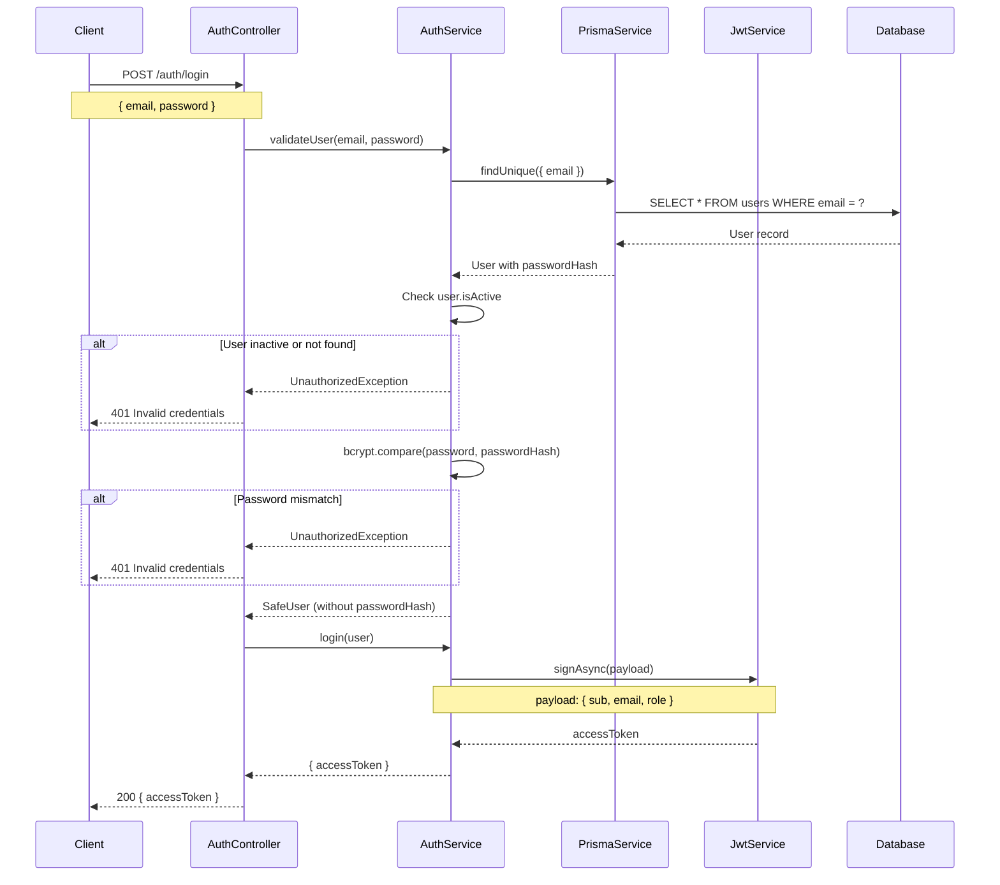
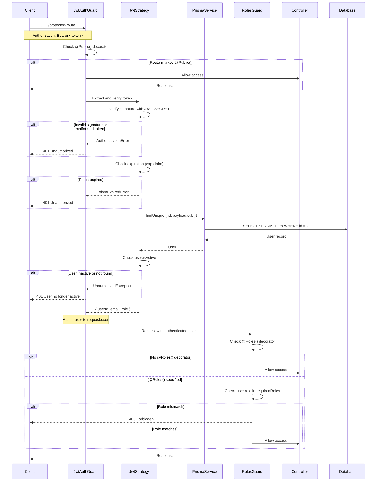

# Authentication Flow

## Overview

The Splitcore backend implements a JWT-based authentication system with role-based access control (RBAC). The system defaults to authenticated access for all routes, with explicit opt-out for public endpoints using the `@Public()` decorator.

## JWT Token Structure

### Token Payload

JWT tokens contain the following claims:

```typescript
interface JwtPayload {
  sub: string;      // Subject: User ID
  email: string;    // User email address
  role: string;     // User role (PLATFORM_ADMIN, RESTAURANT_OWNER, WAITER, etc.)
  iat: number;      // Issued At (automatically added by jwt library)
  exp: number;      // Expiration Time (automatically added by jwt library)
}
```

### Token Configuration

- **Algorithm**: HS256 (HMAC with SHA-256)
- **Secret**: Stored in `JWT_SECRET` environment variable (minimum 32 characters)
- **Expiration**: Configurable via `JWT_EXPIRES_IN` environment variable (default: 1 day)
- **Encoding**: Base64URL encoding for header and payload, with signature

### Token Generation

Tokens are generated during login:

```typescript
async login(user: SafeUser): Promise<{ accessToken: string }> {
  const payload: JwtPayload = { 
    sub: user.id, 
    email: user.email, 
    role: user.role 
  };
  return { 
    accessToken: await this.jwtService.signAsync(payload) 
  };
}
```

### Token Validation

Token validation occurs on every authenticated request through the JWT Strategy:

1. **Extract token** from `Authorization: Bearer <token>` header
2. **Verify signature** using `JWT_SECRET`
3. **Check expiration** (tokens past `exp` claim are rejected)
4. **Validate user status** by querying database for user activity

```typescript
async validate(payload: JwtPayload) {
  const user = await this.prisma.user.findUnique({ 
    where: { id: payload.sub } 
  });

  if (!user || !user.isActive) {
    throw new UnauthorizedException('User no longer active');
  }

  return { 
    userId: user.id, 
    email: user.email, 
    role: user.role 
  };
}
```

**Important**: The system re-validates the user against the database on every request rather than trusting the token payload alone. This ensures deactivated users are locked out immediately, not just when their token expires.

## Authentication Sequence Diagram

### Login Flow



### Protected Route Access Flow



## Role-Based Access Control (RBAC)

### Available Roles

The system defines user roles in the Prisma schema:

```prisma
enum Role {
  PLATFORM_ADMIN
  RESTAURANT_OWNER
  WAITER
  GUEST
}
```

### Role Hierarchy

- **PLATFORM_ADMIN**: Full system access, manages all restaurants and users
- **RESTAURANT_OWNER**: Manages their own restaurant, staff, and settings
- **WAITER**: Access to tips and transaction history for their restaurant
- **GUEST**: Limited access (future: public tipping endpoints)

### Implementing Role-Based Protection

#### Using the @Roles() Decorator

Apply the `@Roles()` decorator to controller methods to restrict access:

```typescript
import { Controller, Get } from '@nestjs/common';
import { Roles } from '../common/decorators/roles.decorator';
import { Role } from '@prisma/client';

@Controller('admin')
export class AdminController {
  // Only PLATFORM_ADMIN can access
  @Roles(Role.PLATFORM_ADMIN)
  @Get('users')
  async getAllUsers() {
    // Implementation
  }

  // PLATFORM_ADMIN or RESTAURANT_OWNER can access
  @Roles(Role.PLATFORM_ADMIN, Role.RESTAURANT_OWNER)
  @Get('dashboard')
  async getDashboard() {
    // Implementation
  }
}
```

### How RolesGuard Works

The `RolesGuard` runs after `JwtAuthGuard` in the guard chain:

1. **Extract required roles** from `@Roles()` decorator metadata
2. If **no @Roles() decorator**, allow access (authenticated users only)
3. If **@Roles() specified**, check `request.user.role` against required roles
4. **Allow** if user role matches any required role
5. **Deny** (403 Forbidden) if user role doesn't match

```typescript
@Injectable()
export class RolesGuard implements CanActivate {
  constructor(private readonly reflector: Reflector) {}

  canActivate(context: ExecutionContext): boolean {
    const requiredRoles = this.reflector.getAllAndOverride<Role[]>(ROLES_KEY, [
      context.getHandler(),
      context.getClass(),
    ]);

    // No @Roles() decorator means authenticated-only (JwtAuthGuard handles this)
    if (!requiredRoles || requiredRoles.length === 0) {
      return true;
    }

    const { user } = context.switchToHttp().getRequest();
    return requiredRoles.includes(user?.role);
  }
}
```

## @Public() Decorator Usage

### Purpose

By default, **all routes require authentication**. The `@Public()` decorator explicitly marks routes that should be accessible without authentication.

### Security Philosophy

The system uses **secure by default** design:

- Global `JwtAuthGuard` protects all routes
- Routes must explicitly opt-out with `@Public()`
- Reduces risk of forgetting to protect sensitive endpoints

### When to Use @Public()

Use `@Public()` for:

1. **Authentication endpoints** (login, register)
2. **Health check endpoints** (system monitoring)
3. **Guest-facing features** (future: public tipping pages)

**Do NOT use** for:

- User data access
- Administrative functions
- Payment processing
- Any sensitive operations

### Implementation

```typescript
import { Controller, Post, Body, Get } from '@nestjs/common';
import { Public } from '../common/decorators/public.decorator';

@Controller('auth')
export class AuthController {
  // Public route - no authentication required
  @Public()
  @Post('login')
  async login(@Body() dto: LoginDto) {
    return this.authService.login(dto);
  }

  // Protected route - authentication required (default behavior)
  @Get('profile')
  async getProfile(@Request() req) {
    return req.user; // Access authenticated user
  }
}
```

### How @Public() Works

The `JwtAuthGuard` checks for the `@Public()` decorator before enforcing authentication:

```typescript
@Injectable()
export class JwtAuthGuard extends AuthGuard('jwt') {
  constructor(private readonly reflector: Reflector) {
    super();
  }

  canActivate(context: ExecutionContext) {
    const isPublic = this.reflector.getAllAndOverride<boolean>(IS_PUBLIC_KEY, [
      context.getHandler(),  // Check method-level decorator
      context.getClass(),    // Check class-level decorator
    ]);

    // Allow access if route is marked public
    if (isPublic) {
      return true;
    }

    // Otherwise enforce JWT authentication
    return super.canActivate(context);
  }
}
```

### Class-Level vs Method-Level

You can apply `@Public()` at class or method level:

```typescript
// All routes in this controller are public
@Public()
@Controller('health')
export class HealthController {
  @Get()
  check() {
    return { status: 'ok' };
  }
}

// Mix public and protected routes
@Controller('docs')
export class DocsController {
  @Public()
  @Get()
  publicDocs() {
    return 'Public documentation';
  }

  @Get('internal')
  internalDocs() {
    return 'Internal documentation'; // Requires authentication
  }
}
```

## Password Security

### Password Hashing

Passwords are hashed using **bcrypt** with 12 salt rounds:

```typescript
static async hashPassword(plain: string): Promise<string> {
  const saltRounds = 12;
  return bcrypt.hash(plain, saltRounds);
}
```

### Password Verification

Password comparison uses constant-time comparison to prevent timing attacks:

```typescript
const passwordMatches = await bcrypt.compare(password, user.passwordHash);
```

### Security Best Practices

1. **Never log passwords**: Password fields are redacted from all logs
2. **Unique salts**: bcrypt generates a unique salt per password automatically
3. **Consistent error messages**: "Invalid email or password" for both wrong email and wrong password (prevents email enumeration)
4. **Password in storage**: Only the hash is stored; plain passwords never touch the database

## Error Responses

### 401 Unauthorized

Returned when authentication fails:

```json
{
  "statusCode": 401,
  "timestamp": "2024-01-15T10:30:00.000Z",
  "path": "/auth/login",
  "error": "UnauthorizedException",
  "message": "Invalid email or password"
}
```

**Triggers**:
- Invalid credentials
- Missing token
- Malformed token
- Expired token
- User account deactivated

### 403 Forbidden

Returned when user is authenticated but lacks required role:

```json
{
  "statusCode": 403,
  "timestamp": "2024-01-15T10:30:00.000Z",
  "path": "/admin/users",
  "error": "ForbiddenException",
  "message": "Forbidden resource"
}
```

**Triggers**:
- User role doesn't match `@Roles()` requirement

## Guard Execution Order

Guards execute in this order for every request:

```
1. ThrottlerGuard (rate limiting)
2. JwtAuthGuard (authentication)
   ├─> If @Public(): allow and skip to controller
   └─> If not @Public(): verify JWT token
3. RolesGuard (authorization)
   ├─> If no @Roles(): allow
   └─> If @Roles(): check user.role
4. Controller method execution
```

## Configuration

### Required Environment Variables

```bash
# JWT configuration
JWT_SECRET=<minimum-32-character-secret>
JWT_EXPIRES_IN=7d

# Database (for user validation)
DATABASE_URL=postgresql://...
```

### JWT Module Configuration

```typescript
JwtModule.registerAsync({
  inject: [ConfigService],
  useFactory: (config: ConfigService) => ({
    secret: config.get<string>('auth.jwtSecret'),
    signOptions: { 
      expiresIn: config.get<string>('auth.jwtExpiresIn') 
    },
  }),
})
```

## Security Considerations

### Token Storage (Client-Side)

- **Recommended**: Store tokens in memory or httpOnly cookies
- **Avoid**: localStorage (vulnerable to XSS attacks)

### Token Expiration

- Default: 1 day (production), 7 days (common for web apps)
- Shorter expiration = more secure but more frequent logins
- No refresh token implementation in Phase 1

### Database Revalidation

Every authenticated request queries the database to verify user status. This:
- **Ensures** deactivated users are immediately locked out
- **Prevents** token-based access after account deactivation
- **Trade-off**: Additional database query per request (acceptable for Phase 1 scale)

### Rate Limiting

Authentication endpoints are rate-limited separately:
- **Auth endpoints**: 5 requests per 60 seconds per IP
- **General endpoints**: 100 requests per 60 seconds per IP

See [Rate Limiting Documentation](../deployment/rate-limiting.md) for details.

## Testing Authentication

### Unit Testing

Test authentication logic:

```typescript
describe('AuthService', () => {
  it('should validate correct credentials', async () => {
    const user = await service.validateUser('test@example.com', 'password');
    expect(user).toBeDefined();
    expect(user.passwordHash).toBeUndefined();
  });

  it('should reject invalid password', async () => {
    await expect(
      service.validateUser('test@example.com', 'wrong')
    ).rejects.toThrow(UnauthorizedException);
  });
});
```

### E2E Testing

Test complete authentication flow:

```typescript
describe('AuthController (e2e)', () => {
  it('should login with valid credentials', async () => {
    const response = await request(app.getHttpServer())
      .post('/auth/login')
      .send({ email: 'admin@example.com', password: 'password' })
      .expect(200);

    expect(response.body.accessToken).toBeDefined();
  });

  it('should protect routes without token', async () => {
    await request(app.getHttpServer())
      .get('/protected')
      .expect(401);
  });

  it('should allow access with valid token', async () => {
    const { token } = await createAuthenticatedTestContext(prisma, Role.WAITER);
    
    await request(app.getHttpServer())
      .get('/protected')
      .set('Authorization', `Bearer ${token}`)
      .expect(200);
  });
});
```

## Future Enhancements (Phase 2+)

Potential authentication improvements:

- **Refresh tokens** for longer sessions with short-lived access tokens
- **OAuth2/Social login** (Google, Facebook)
- **Two-factor authentication (2FA)**
- **Password reset flow** with email verification
- **Session management** (view active sessions, revoke tokens)
- **Audit logging** for authentication events

## Related Documentation

- [Module Architecture](./002-module-architecture.md)
- [Security Middleware](../deployment/security-hardening.md)
- [API Documentation](../api/swagger.md)
